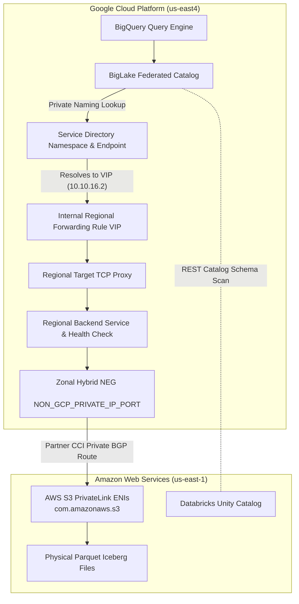

# Cross-Cloud Lakehouse (CCL) Solution Architecture

This production-grade solution blueprint automates the end-to-end deployment of an enterprise **Cross-Cloud Lakehouse**, federating external **Databricks Unity Catalog** tables (hosted on AWS) directly into Google Cloud BigLake and BigQuery. It natively establishes a secure Layer 4 / Layer 7 private network bridge over **Partner Cross-Cloud Interconnect (CCI)**, ensuring physical S3 storage scans never traverse the public internet.



## Architectural Design Pattern
In alignment with enterprise modularity standards, this solution composes two powerful capability layers:
1. **`../../modules/ccl_private_bridge` (Network Backbone)**: Composes foundational primitives from `tf-goog-modules` (`neg`, `region_health_check`, `region_backend_service`, `tcp_routing`, `forwarding_rule`, and `service_directory`) into a resilient, race-condition-free private network bridge.
2. **`../../modules/ccl_federated_catalog` (Data Federation)**: Connects Google Cloud BigLake directly to the generated Service Directory private resource path, enabling seamless metadata sync and private SQL querying against external Databricks tables.

## Deployment Checklist & Team Handover

To deploy this solution, gather the required parameters from your organizational peers:

### 1. From the GCP Platform Team:
* **`vpc_network`**: The Resource Manager ID of the VPC where Partner CCI terminates.
* **`subnetwork`**: The regional subnetwork ID where the load balancer VIP should reside.
* **Proxy Subnet**: Confirm that an active `REGIONAL_MANAGED_PROXY` subnetwork exists in the target region (`us-east4`).

### 2. From the AWS Infrastructure Team:
* **`aws_s3_private_endpoints`**: The exact private IPv4 addresses and port (`443`) of the AWS S3 Interface VPC Endpoint (`com.amazonaws.<region>.s3`) ENIs.
* **Security Group Whitelisting**: Verify that AWS Security Groups attached to these ENIs permit ingress TCP port 443 traffic originating from your GCP `REGIONAL_MANAGED_PROXY` subnetwork CIDR.
* **Databricks Admin Switches**: Verify that **External Data Access** is toggled ON in the Unity Catalog metastore and that targeted catalogs utilize an **External Location on AWS S3**.

## Quickstart Guide
1. Copy the sample variables file:
   ```bash
   cp terraform.tfvars.sample terraform.tfvars
   ```
2. Edit `terraform.tfvars` with your exact team IDs and target IP addresses.
3. Initialize and apply:
   ```bash
   terraform init
   terraform plan
   terraform apply
   ```
